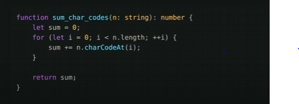
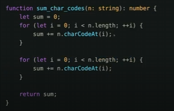
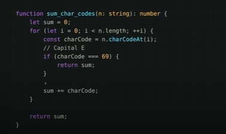
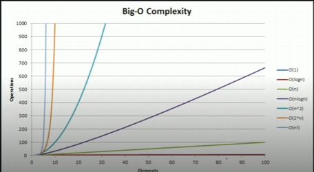
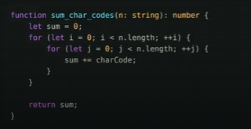
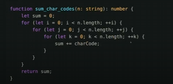

# Big O Notation

https://frontendmasters.com/courses/algorithms/big-o-time-complexity/

## 1. Growth of Computation and Memory

> **"As your input grows, how fast does computation or memory grow?"**

For every additional unit of a string (a character), our algorithm grows linearly.
- Example: A 50% bigger string results in a 50% bigger algorithm.
- **Complexity:** \(O(n)\)

### **Quick Trick:** Where do you loop over the input?

**Is it O(2N) because of 2 for loops?** No.
- **Rule:** You always drop constants.
- **Final Complexity:** \(O(N)\)

---

## 2. Understanding Big O Rules

### **Dropping Constants**
- \(O(N)\) is generally faster than \(O(N^2)\), but for small inputs, not necessarily.
- Example:
  - \(100N\) vs \(N^2\) for small datasets.

### **Worst Case Analysis**

In Big O, we consider the **worst-case** scenario:
- Even if the algorithm terminates early, we assume the worst case.
- Example: Searching for 'E' – worst case is when 'E' is not present or at the end.
- **Final Complexity:** \(O(N)\)

---

## 3. Common Complexities

### **Examples of Complexity Classes:**

#### **O(N^2) Complexity**

#### **O(N^3) Complexity**

#### **O(n log n) Complexity**
- **Example:** Quicksort

#### **O(log n) Complexity**
- **Example:** Binary search trees

#### **Rarely Seen Complexity:**
- \(O(\sqrt{n})\) (Only once seen)

---

This document provides a clear understanding of Big O notation, covering fundamental principles and common complexities.

To maintain image references in your Markdown file, ensure that the image files are present in the same directory as the `.md` file or use absolute URLs if hosted online.

