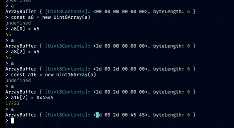

# Arrays

## Introduction

[Frontend Masters: Arrays & Data Structures](https://frontendmasters.com/courses/algorithms/arrays-data-structure/)

An **array** is a **contiguous block of memory** where each element is stored sequentially. Accessing an index in an array is efficient because it's just a matter of computing:

\[ \text{Base Address} + ( \text{Index} \times \text{Element Size} ) \]

This means that accessing an element at a certain index is a **constant time operation** \(O(1)\). However, arrays have strict memory constraints:

- They **cannot grow** dynamically.
- There are **no built-in push/pop methods** like in higher-level list implementations.
- You can implement such operations manually.

### **Bitwise Offsetting & Memory Calculation**

Arrays rely on **bitwise offsetting** to determine where an element is stored in memory. The size of each element affects how far apart indices are stored.



---

## **Key Differences: List vs. Array**

> **A "list" is not an "array"!**

In JavaScript:
```js
const a = [];
```
This is **not** a true array, but rather a **dynamic list** (an object-backed structure) that mimics array behavior. True low-level arrays have fixed memory allocation, whereas JavaScript lists can resize dynamically.

We will dive deeper into this later.

---

## **Topics for Today**

### 1️⃣ **What is an Array?**
- A **contiguous block of memory** storing elements of the same type.
- Fast **index-based access** (Big-O: **O(1)**).

### 2️⃣ **Getting an Index in an Array**
- Formula: `Base Address + (Index × Element Size)`
- **Big-O Complexity:** \(O(1)\) → **Constant time**

### 3️⃣ **Insertion at an Index**
- Access the memory address and overwrite the value: `a + width * offset`
- **Big-O Complexity:** \(O(1)\) → **Constant time**

### 4️⃣ **Deletion at an Index**
- Deletion is essentially setting the value to `00` (null/empty value in memory).
- **Big-O Complexity:** \(O(1)\) → **Constant time**


